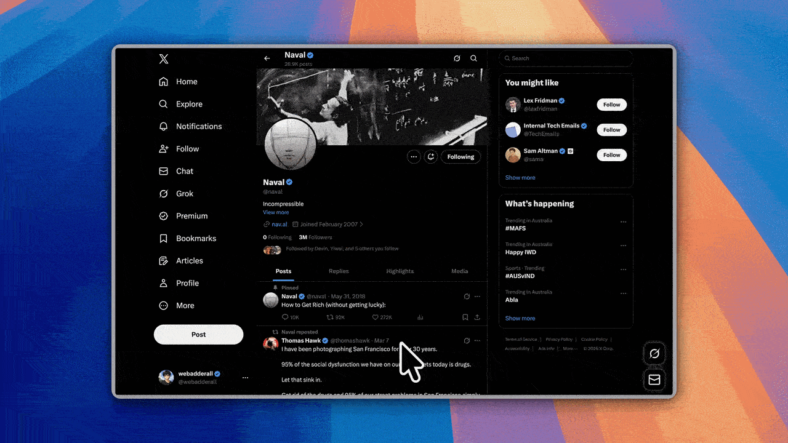

Language: EN | [简中](README.zh-CN.md)

<p align="center">
  
</p>

<p align="center">
  
  
  
</p>

### Create polished demo videos with AI — 在几分钟内做出精致的演示视频
**言镜 (Yanjing Recorder)** 是一款基于 [Recordly](https://github.com/webadderallorg/Recordly) 的开源屏幕录制器,加入了 **AI 双语字幕、智能剪辑、行业热词、AI 章节摘要**。  
**Open source.** [yanjingai.tech](https://yanjingai.tech) · [hi@yanjingai.tech](mailto:hi@yanjingai.tech) · [ATTRIBUTION](./ATTRIBUTION.md)

> 本软件是基于 Recordly 修改而来的衍生作品 (AGPL 3.0)。感谢 [@webadderall](https://github.com/webadderall) 的开源贡献。

## What is 言镜 (Yanjing Recorder)?

言镜 是一款桌面应用,用于录制和编辑屏幕内容,内置面向演示视频的动态呈现工具。基于上游 Recordly,我们加入了 **AI 增强**: 双语字幕、行业热词、智能章节、标题生成、社媒文案。原始的屏幕录制、动态缩放、光标润色、样式化背景等核心功能全部保留。

Recordly runs on:

- **macOS** 14.0+
- **Windows** 10 Build 19041+
- **Linux** on modern distros

Platform notes:

- **macOS** uses native ScreenCaptureKit-based capture helpers.
- **Windows** uses a native Windows Graphics Capture (WGC) helper on supported builds, with native WASAPI audio support.
- **Linux** records through Electron capture APIs. Cursor hiding is not supported on Linux today.

---

# Core Features


---

## What's new in 言镜 (vs upstream Recordly)?

### ✨ AI 双语字幕 (P0)
基于 OpenAI Whisper 转录 + GPT-4 翻译,一键生成中英/中法/中日等双语字幕。**行业热词可选**:法律 / 医疗 / 电商 / 教育。

### ✨ AI 章节与摘要 (P0)
自动识别视频章节,生成 30 秒摘要、3 段亮点、社媒文案 (Twitter / 小红书 / 公众号 / B 站)。

### ✨ AI 行业热词 (P1)
4 个开箱即用的中文热词词库 (法律 / 医疗 / 电商 / 教育),显著提升专业内容转录准确率。

### ✨ 中文 UI 优化 (P1)
基于上游 zh-CN 翻译,补充缺失字段,优化繁简切换体验。

### ✨ 极简风设计 (P1)
参考 §213 极简风,纯黑 `#0a0a0a` + 绿点 `#22c55e`,突出内容本身。

> **保留所有上游 Recordly 特性**:屏幕录制、动态缩放、光标润色、样式化背景、摄像头气泡、时间线编辑、扩展市场、CUDA 导出、MP4/GIF 输出、SRT/VTT 字幕导出。**没有删除任何上游功能**。

---

## Auto-zooms, cursor polish, and styled frames _(preserved from Recordly)_
Recordly's core auto-zoom can automatically emphasize activity with zoom suggestions, smooth cursor movement, add motion effects, and place the final composition inside a styled frame with wallpapers, colors, gradients, blur, padding, and shadows.

<p>
  
</p>

## Dynamic webcam bubble overlays
Add webcam footage as an overlay bubble, position it with presets or custom coordinates, mirror it, control shadow and roundness, and optionally make it react to zoom so it stays visually balanced during motion.

<p>
  
</p>

## Timeline editing built for demos
Use drag-and-drop timeline tools for zooms, trims, speed regions, annotations, extra audio regions, and crop-aware edits. Save and reopen work as `.recordly` project files.

<p>
  
</p>

## Extensions & Marketplace

Recordly has a community-driven extension system. Anyone can build and publish extensions that add new capabilities to Recordly — cursor click sounds, device frames, browser mockups, wallpapers, render hooks, settings panels, and more.

Browse and install community extensions from the [Recordly Marketplace](https://marketplace.recordly.dev/extensions).

---

## All Features

### Recording

- Record an entire display or a single app window
- Jump directly from recording into the editor
- Capture microphone audio and system audio
- Use native capture backends where supported
- Resume editing from saved `.recordly` project files
- Open existing recordings or existing project files from the app

### Timeline and Editing

- Drag-and-drop timeline editing
- Trim unwanted sections
- Add manual zoom regions
- Use automatic zoom suggestions based on cursor activity
- Add speed-up and slow-down regions
- Add text, image, and figure annotations
- Add extra audio regions on the timeline
- Crop the recorded frame
- Save and reopen projects with editor state preserved

### Cursor Controls

- Show or hide the rendered cursor overlay
- Cursor size adjustment
- Cursor smoothing
- Cursor motion blur
- Cursor click bounce
- Cursor sway
- Cursor loop mode for cleaner looping exports
- macOS-style cursor assets for the rendered overlay

### Webcam Overlay

- Enable or disable webcam overlay footage
- Upload, replace, or remove webcam footage
- Mirror webcam footage
- Size control
- Preset positions and custom X/Y placement
- Margin control
- Roundness control
- Shadow control
- Optional zoom-reactive webcam scaling

### Frame Styling and Backgrounds

- Built-in wallpapers
- Runtime wallpaper discovery from the wallpapers directory
- Custom uploaded backgrounds
- Solid color backgrounds
- Gradient backgrounds
- Frame padding
- Rounded corners
- Background blur
- Drop shadows
- Aspect ratio presets for the final frame

### Export

- MP4 export
- GIF export
- Export quality selection
- GIF frame-rate selection
- GIF loop toggle
- GIF size presets
- Aspect ratio and output dimension controls
- Reveal exported files in the system file manager

### Workflow and Usability

- Customizable keyboard shortcuts
- In-app shortcut reference
- Feedback and issue links from the editor
- Project persistence for editor preferences
- Faster preview recovery after export
---

# Screenshots

<p align="center">
  
</p>

<p align="center">
  
</p>

<p align="center">
  
</p>

---

# Installation

## Download a build

Prebuilt releases are available at:

https://github.com/webadderallorg/Recordly/releases

---

## Arch Linux / Manjaro (yay)

Install from the AUR ([recordly-bin](https://aur.archlinux.org/packages/recordly-bin)):

```bash
yay -S recordly-bin
```

PKGBUILD, desktop entry, release sync, and optional **local-from-source** packaging live in **[recordly-aur](https://github.com/firtoz/recordly-aur)** so this repository stays free of Arch release chores. For maintainer contact and how the package is updated, see that repo or the AUR package page.

---

## Build from source

### Prerequisites

**macOS:** Xcode Command Line Tools (`xcode-select --install`).

**Linux (Ubuntu/Debian):**

```bash
sudo apt install build-essential cmake libx11-dev libxtst-dev libxrandr-dev libxt-dev
```

**Windows:** Visual Studio 2022 (or Build Tools) with the C++ workload and CMake.

### Steps

```bash
git clone https://github.com/webadderallorg/Recordly.git recordly
cd recordly
npm install
npm run dev
```

For packaged builds:

```bash
npm run build
```

Target-specific build commands are also available:

- `npm run build:mac`
- `npm run build:win`
- `npm run build:linux`

---

## macOS: "App cannot be opened"

Locally built apps may be quarantined by macOS.

Remove the quarantine flag with:

```bash
xattr -rd com.apple.quarantine /Applications/Recordly.app
```

---

# System Requirements

| Platform | Minimum version | Notes |
|---|---|---|
| **macOS** | macOS 14.0 (Sonoma) | Required for ScreenCaptureKit audio and microphone capture. |
| **Windows** | Windows 10 20H1 (Build 19041, May 2020) | Required for the native Windows Graphics Capture (WGC) helper and best cursor-hiding behavior. |
| **Linux** | Any modern distro | Recording works through Electron capture. System audio generally requires PipeWire. |

> [!IMPORTANT]
> On Windows builds older than 19041, recording can still work through fallback capture, but the real OS cursor may remain visible in recordings.

---

# Usage

## Record

1. Launch Recordly.
2. Select a screen or window.
3. Choose microphone and system-audio options.
4. Start recording.
5. Stop recording to open the editor.

## Edit

Inside the editor you can:

- add trims, zooms, speed regions, and annotations
- tune cursor behavior and preview volume
- style the frame with wallpapers, colors, gradients, blur, padding, and corners
- add or adjust webcam overlay footage
- add extra audio regions
- crop the frame and choose an aspect ratio

Save your work anytime as a `.recordly` project.

## Export

Export options include:

- **MP4** for standard video output
- **GIF** for lightweight sharing and loops

You can adjust format-specific settings such as quality, GIF frame rate, GIF looping, and output size before export.

---

# Limitations

### Cursor capture

Recordly renders a polished cursor overlay on top of the recording. Platform cursor-hiding behavior still depends on OS support.

**macOS**
- ScreenCaptureKit can exclude the real cursor cleanly.

**Windows**
- Best results require Windows 10 Build 19041+ and the native capture helper.
- Older builds fall back to Electron capture, so the real cursor may remain visible.

**Linux**
- Electron desktop capture does not currently support cursor hiding.
- If you also enable the rendered cursor overlay, exports may show both the real cursor and the styled cursor.

### System audio

System audio support varies by platform.

**Windows**
- Native WASAPI support

**Linux**
- Usually requires PipeWire

**macOS**
- Requires macOS 14.0+ and the ScreenCaptureKit-based workflow

---

# How It Works

Recordly combines a platform-specific capture layer with a renderer-driven editor and export pipeline.

**Capture**
- Electron coordinates recording and application flow
- macOS uses native ScreenCaptureKit helpers
- Windows uses a native Windows Graphics Capture (WGC) helper and native audio helpers where available

**Editing**
- Timeline regions define zooms, trims, speed changes, audio overlays, and annotations
- Cursor and webcam styling are applied in the editor state

**Rendering**
- Scene composition is handled by **PixiJS**

**Export**
- The same scene logic used in preview is rendered into exported MP4 or GIF output

**Projects**
- `.recordly` files store the source media path plus editor state so work can be reopened later

---

# Contribution

Contributions are welcome.

Areas where help is especially useful:

- Linux capture and cursor behavior
- Export performance and stability
- UI and UX refinement
- Localisation work
- Additional editor tools and workflow polish

Please keep pull requests focused, test recording/edit/export flows, and avoid unrelated refactors.

See `CONTRIBUTING.md` for guidelines.

---

# Community

Bug reports and feature requests:

https://github.com/webadderallorg/Recordly/issues

Pull requests are welcome.

---

# Hall of Supporters

[](https://ko-fi.com/webadderall)

- Tom Egan @tomegan on X
- Robin Ebers @robinebers on X
- Tadees
- buildwithfur
- piccinato
- Tobias
- Anonymous Supporter
- Tandava Appadoo
- Digitalfastmind
- Roberto Marcelino
- Tony
- Rajan RK
- Francesco
- Erwan
- Anonymous supporter

---

# License

Recordly is licensed under the **AGPL 3.0**.

---

# Credits

## Acknowledgements

Recordly originally started as a fork of [OpenScreen](https://github.com/siddharthvaddem/openscreen). Over 80% of code has diverged since.
Many features of OpenScreen such as its zoom animations are directly ported from early versions of Recordly.

Created by  
[@webadderall](https://x.com/webadderall)

---
